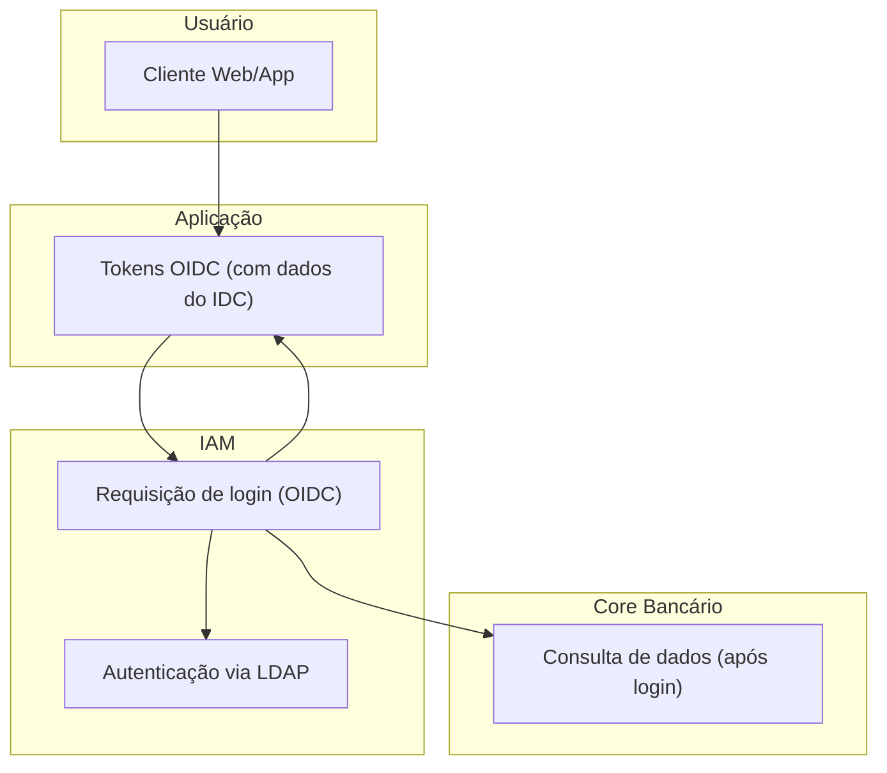

```mermaid
graph TD

subgraph Usuário
    browser[Cliente Web/App]
end

subgraph Aplicação
    app["Aplicação .NET (OIDC Client)"]
end

subgraph IAM
    keycloak["Red Hat SSO (Keycloak)"]
    ldap["RHDS (simulado com OpenLDAP)"]
end

subgraph Core Bancário
    idc["IDC (Cadastro Mestre de Clientes)"]
end

browser --> app
app --> keycloak["Requisição de login (OIDC)"]
keycloak --> ldap["Autenticação via LDAP"]
keycloak --> idc["Consulta de dados (após login)"]
keycloak --> app["Tokens OIDC (com dados do IDC)"]

```
